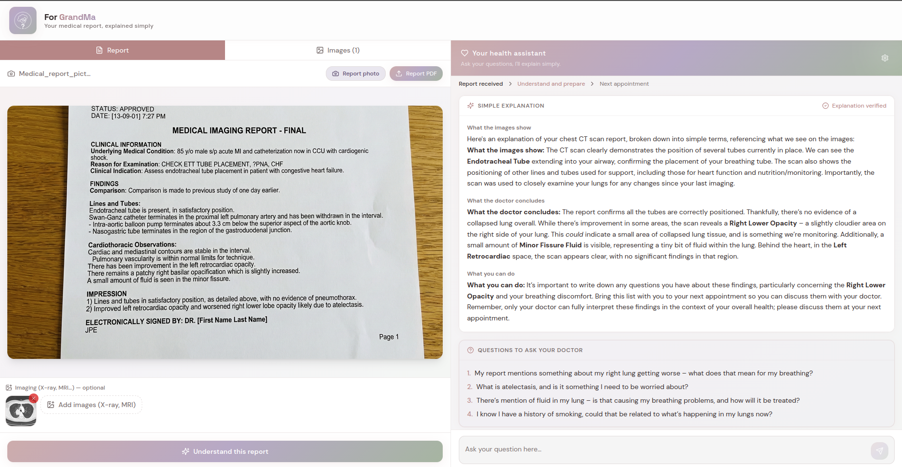

# For GrandMa



An app to help you understand your technical medical report in plain English. Simple enough for you, your family, and even Grandma!

## 🚀 Getting Started

1. **Installation**:

   ```bash
   npm install
   cd server && npm install && cd ..
   ```

2. **Configuration**:

   ```bash
   cp .env.example .env # Add your GOOGLE_API_KEY in the .env file
   ```

3. **Development**:

   ```bash
   npm run dev
   ```

   - Frontend: [http://localhost:8080](http://localhost:8080)
   - Backend: [http://localhost:3001](http://localhost:3001)

## 🛠️ Commands

- `npm run dev`: Frontend + Backend (development mode)

## 📂 Structure

- `src/`: Frontend React (Vite)
- `server/`: Backend Node.js (Express)
- `docs/`: Test documents, images, and demo assets
- `public/`: Static assets (favicon, etc.)
